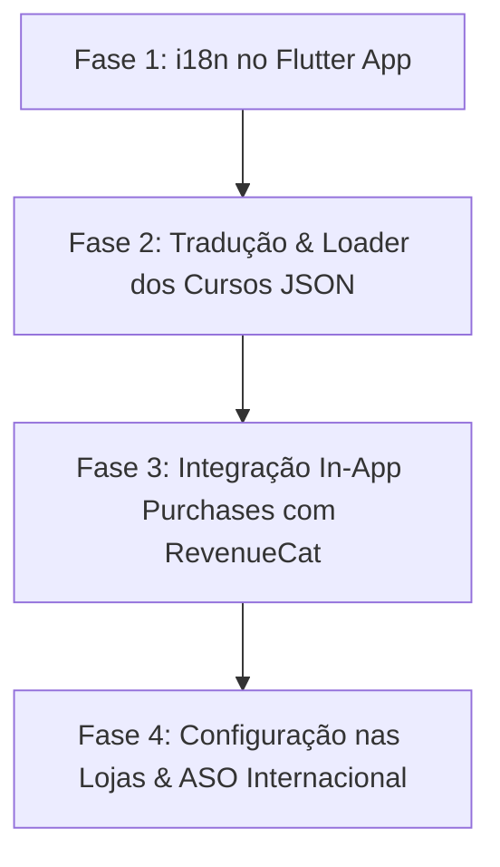

# MAN HUB | Plano de Internacionalização, Tradução e In-App Purchases (IAP)

Este documento registra a estratégia técnica, arquitetura de software e plano de execução para a expansão global do **MAN HUB**, incluindo suporte a múltiplos idiomas, localização de cursos e integração de compras nativas nas lojas de aplicativos (Apple App Store e Google Play Store).

---

## 🌍 1. Visão Geral da Expansão Global

Para distribuir o Man Hub em múltiplos países (com foco inicial em América Latina, América do Norte e Europa), três frentes principais precisam ser orquestradas:

1. **Localização da Interface do App (i18n):** Tradução dos elementos visuais, menus, botões, títulos de abas e telas administrativas no Flutter.
2. **Arquitetura de Tradução dos Treinamentos (JSONs de Conteúdo):** Gestão de conteúdo multilíngue mantendo performance, baixo uso de memória e facilidade de criação.
3. **Pagamentos Nacionais e Internacionais (In-App Purchases):** Conformidade estrita com as políticas da Apple e do Google para bens digitais através de uma infraestrutura unificada.

---

## 📚 2. Arquitetura de Conteúdo: JSONs por Idioma

### Decisão Arquitetural
Adotar **arquivos JSON separados por código de idioma** (`ISO 639-1`), em vez de agrupar múltiplos idiomas em um único arquivo gigante.

```text
man_hub_app/contents/
├── pt/
│   ├── curso_o_homem_bem_vestido.json
│   ├── curso_pele_cabelo_barba.json
│   └── curso_perfumaria_masculina.json
├── en/
│   ├── curso_o_homem_bem_vestido.json
│   ├── curso_pele_cabelo_barba.json
│   └── curso_perfumaria_masculina.json
└── es/
    ├── curso_o_homem_bem_vestido.json
    ├── curso_pele_cabelo_barba.json
    └── curso_perfumaria_masculina.json
```

### Justificativas Técnicas:
* **Economia de Recursos (RAM & Rede):** O app carrega em memória estritamente o curso no idioma do usuário logado. Como os cursos contêm centenas de telas, descrições ricas e metadados, arquivos unificados triplicariam desnecessariamente o footprint do app.
* **Integridade dos Modelos Dart:** Mantém as classes `TitleBlock`, `DescriptionBlock`, `HighlightedDescriptionBlock` e `ScreenModel` consumindo propriedades `String`, sem a complexidade de `Map<String, String>` em cada nó.
* **Pipeline de Tradução:** Permite automatizar a tradução via scripts de IA (ex: Gemini API / OpenAI API), lendo o arquivo `.json` em português e gerando a versão traduzida mantendo intactos todos os `id`, `type`, URLs de imagem e vídeos.
* **Content Creator Isolado:** O painel administrativo pode abrir um arquivo de idioma específico para revisão sem poluir a interface do autor com campos duplicados por língua.

---

## 💳 3. Sistema de Pagamentos Globais: In-App Purchases (Apple & Google)

### Diretrizes de Loja Obrigatórias
* **Apple StoreKit (Guideline 3.1.1):** Proíbe expressamente links externos, Pix ou botões de cartão de crédito para desbloqueio de conteúdo digital consumido no aplicativo.
* **Google Play Billing:** Exige o faturamento nativo do Google Play para assinaturas e compras dentro do app no ecossistema Android.
* O **Mercado Pago** atual nas Cloud Functions continuará válido para compras realizadas diretamente na versão Web ([man_hub_web](file:///c:/flutter_projects/Man%20Hub/man_hub_web)), mas o aplicativo mobile deve consumir a infraestrutura nativa.

### Solução Recomendada: RevenueCat (`purchases_flutter`)
O **RevenueCat** será utilizado como camada de abstração entre as lojas e o app:
1. **Conversão de Moeda Automática:** O usuário em qualquer país do mundo verá o preço em sua moeda nativa (BRL, USD, EUR, GBP, etc.) conforme configurado no App Store Connect e Google Play Console.
2. **Sincronização de Assinaturas e Acesso:**
   * Assinatura recorrente: `man_hub_pass_monthly`
   * Compra vitalícia de cursos: `curso_vestimenta_lifetime`, `curso_visagismo_lifetime`, etc.
3. **Botão de Restauração Obrigatório:** Facilidade para restaurar compras prévias ao trocar de aparelho ou reinstalar o aplicativo.
4. **Sincronização Web + App:** O status de compra (entitlements) pode ser espelhado no Firebase Firestore para liberar acesso indistintamente no app e no site.

---

## 📱 4. Localização da Interface do App Flutter (`flutter_localizations`)

### Padrão Oficial do Flutter: ARB (Application Resource Bundle)
1. Ativação de `generate: true` no `pubspec.yaml` e arquivo de configuração `l10n.yaml`.
2. Criação dos arquivos de recursos em `lib/l10n/`:
   * `app_pt.arb` (Português - Padrão)
   * `app_en.arb` (Inglês)
   * `app_es.arb` (Espanhol)
3. **Chaves principais mapeadas:**
   * Navegação e abas (Home, Aulas, Progresso, Perfil, Configurações);
   * Controles de áudio e vídeo;
   * Mensagens de erro, carregamento e conexão;
   * Tela de pagamento e botões de compra/assinatura;
   * Informações legais (Termos de Uso e Política de Privacidade).
4. **Resolução de Idioma:**
   * Prioridade 1: Preferência selecionada manualmente pelo usuário no menu de configurações do app.
   * Prioridade 2 (Padrão): Idioma do sistema operacional do smartphone.
   * Fallback: Inglês (`en`) para localidades não mapeadas explicitamente.

---

## 🚀 5. Roteiro de Execução (Fases de Implementação)



### Fase 1: Internacionalização da UI do App
- [ ] Adicionar `flutter_localizations` e `intl` ao `man_hub_app`.
- [ ] Extrair todas as strings hardcoded das telas atuais para o catálogo `app_pt.arb`.
- [ ] Criar as versões correspondentes `app_en.arb` e `app_es.arb`.
- [ ] Adicionar dropdown/seletor de idioma na tela de Perfil / Configurações.

### Fase 2: Tradução e Carregamento de Cursos
- [ ] Reestruturar pasta de conteúdos para pastas de idiomas (`contents/{locale}/`).
- [ ] Gerar traduções dos 3 cursos atuais preservando estrutura JSON idêntica.
- [ ] Ajustar o repository do app para carregar os arquivos dinamicamente baseado no `Locale` ativo do app.
- [ ] Adicionar suporte a alternância de idioma de edição no `man_hub_content_creator`.

### Fase 3: In-App Purchases e Assinaturas
- [ ] Criar projeto e configurar credenciais no painel do RevenueCat.
- [ ] Adicionar pacote `purchases_flutter` ao app Flutter.
- [ ] Configurar os produtos digitais:
  * Man Hub Pass (Recorrente Mensal)
  * Cursos Avulsos (Acesso Vitalício)
- [ ] Construir a tela de Paywall com renderização de preços locais dinâmicos e ação de "Restaurar Compras".
- [ ] Webhook do RevenueCat conectado ao Firebase Firestore para atualização em tempo real de permissões do usuário.

### Fase 4: Lojas e ASO (App Store Optimization)
- [ ] Configuração de acordos fiscais e bancários para recebimento internacional no App Store Connect e Google Play Console.
- [ ] Tradução das fichas de loja (Título, Subtítulo, Descrição Curta, Descrição Longa e Palavras-chave) para PT, EN e ES.
- [ ] Criação de capturas de tela (screenshots) com textos em cada respectivo idioma.
